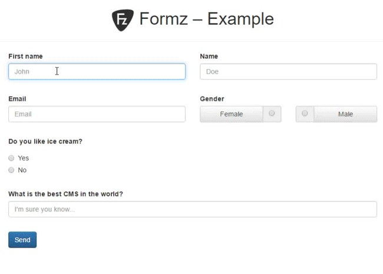

#  FormZ • Modern form handler

> [](https://travis-ci.org/romm/formz) [](https://coveralls.io/github/romm/formz?branch=master) [](https://scrutinizer-ci.com/g/romm/formz/?branch=master) [](https://packagist.org/packages/romm/formz) [](https://packagist.org/packages/romm/formz) [](https://insight.sensiolabs.com/projects/9ec58fe3-3e6c-4524-82bd-b6e2a14824a2) [](https://styleci.io/repos/69821260)

> **→ [FormZ official website](http://typo3-formz.com/)**

> “Manage your forms easily with powerful tools: TypoScript based validation, Fluid view helpers, a whole JavaScript API, and more. Use pre-defined layouts for Twitter Bootstrap and Foundation to build nice-looking forms in minutes. Need to build a basic form with only two fields? Need to build a huge registration form with dozens of fields? Use FormZ, it will live up to your expectations!”

> :heavy_exclamation_mark: *This PHP library has been developed for [TYPO3 CMS](https://typo3.org) and is intended to TYPO3 extension developers.*

>  Join the discussion on Slack in channel [**#ext-formz**](https://typo3.slack.com/messages/ext-formz)! – You don't have access to TYPO3 Slack? Get your Slack invitation [by clicking here](https://forger.typo3.org/slack)!

---

## Introduction

Forms are **common elements in the conception of a website**, as they allow a **direct interaction** between the user and the application. Technically, setting up a form can quickly become **complex** and require a **lot of time**: many aspects must be considered: **style, display conditions, validation, security**…

This is why FormZ was born: to facilitate the **set up** and the **maintenance** of a form, by providing tools that are **simple and fast to use**, but also **powerful and flexible** enough to fulfill every need.

FormZ helps with the following topics:

- **HTML** – tools are provided for Fluid, to facilitate integration.

- **Validation** – with a TypoScript based configuration, every field's validation rule is easy to set up and maintain.

- **Style** – an advanced “data attributes” system allows FormZ to fulfill almost all possible display needs.

- **UX** – a whole JavaScript API is provided to make the user experience as fast and as pleasant as possible.

- **Code generation** – FormZ can generate JavaScript and CSS, which are then injected into the page and will automatize a huge part of the client-sided behaviours.

## Example

Nothing can be more interesting than a little example to understand how it works.

:arrow_right: You can download an extension which provides a form example here: https://github.com/romm/formz_example/

---

**Live example:**



---

**TypoScript configuration:**

```
config.tx_formz {
    forms {
        Romm\FormzExample\Form\ExampleForm {
            fields {
                name {
                    validation {
                        required < config.tx_formz.validators.required
                    }
                }

                firstName {
                    validation {
                        required < config.tx_formz.validators.required
                    }
                }

                email {
                    validation {
                        required < config.tx_formz.validators.required
                        isEmail < config.tx_formz.validators.email
                    }
                    behaviours {
                        toLowerCase < config.tx_formz.behaviours.toLowerCase
                    }
                }

                gender {
                    validation {
                        required < config.tx_formz.validators.required

                        isValid < config.tx_formz.validators.containsValues
                        isValid {
                            options {
                                values {
                                    10 = male
                                    20 = female
                                }
                            }
                        }
                    }
                }
            }
        }
    }
}
```

**PHP form model:**

```php
<?php
namespace Romm\FormzExample\Form;

use Romm\Formz\Form\FormInterface;
use Romm\Formz\Form\FormTrait;

class ExampleForm implements FormInterface
{

    use FormTrait;

    /**
     * @var string
     */
    protected $email;

    /**
     * @var string
     */
    protected $name;

    /**
     * @var string
     */
    protected $firstName;

    /**
     * @var string
     */
    protected $gender;

    // Setters and getters...
}
```

**Fluid template:**

```html
<fz:form action="submitForm" name="exampleForm">
    <div class="row">
        <div class="col-md-6 form-group">
            <fz:field name="firstName" layout="bootstrap3">
                <fz:option name="label" value="First name" />
                <fz:option name="required" value="1" />

                <fz:slot name="Field">
                    <f:form.textfield class="{inputClass}" property="{fieldName}" id="{fieldId}" placeholder="First name" />
                </fz:slot>
            </fz:field>
        </div>

        <div class="col-md-6 form-group">
            <fz:field name="name" layout="bootstrap3">
                <fz:option name="label" value="Name" />
                <fz:option name="required" value="1" />

                <fz:slot name="Field">
                    <f:form.textfield class="{inputClass}" property="{fieldName}" id="{fieldId}" placeholder="Name" />
                </fz:slot>
            </fz:field>
        </div>
    </div>

    <div class="row">
        <div class="col-md-6 form-group">
            <fz:field name="email" layout="bootstrap3">
                <fz:option name="label" value="Email" />
                <fz:option name="required" value="1" />

                <fz:slot name="Field">
                    <f:form.textfield class="{inputClass}" property="{fieldName}" id="{fieldId}" placeholder="Email" />
                </fz:slot>
            </fz:field>
        </div>

        <div class="col-md-6 form-group">
            <fz:field name="gender" layout="bootstrap3">
                <fz:option name="label" value="Gender" />
                <fz:option name="required" value="1" />

                <fz:slot name="Field">
                    <label for="{fieldId}-female">Female</label>
                    <f:form.radio property="{fieldName}" id="{fieldId}-female" value="female" />

                    <label for="{fieldId}-male">Male</label>
                    <f:form.radio property="{fieldName}" id="{fieldId}-male" value="male" />
                </fz:slot>
            </fz:field>
        </div>
    </div>

    <f:form.submit value="Send" class="btn btn-primary" />
</fz:form>
```
